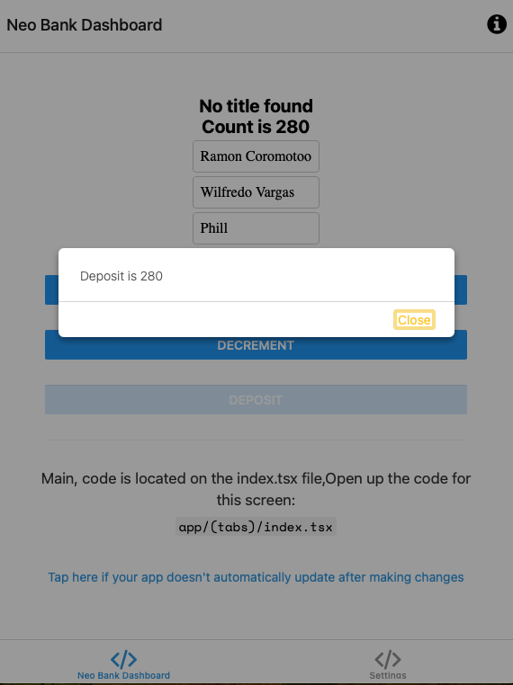

# NeoBank Application

Financial application where can register transaction online

## 🚀 Features

- Register user
- Consume 
- Process transaction

## 🛠️ Installation

## Setting Deposit
Below show an example how to setup a deposit of 280 by clicking deposit from the dashboard

## Illustration




```bash
git clone repo
cd repo
npm install and run npm web on safari as part of the testing```
